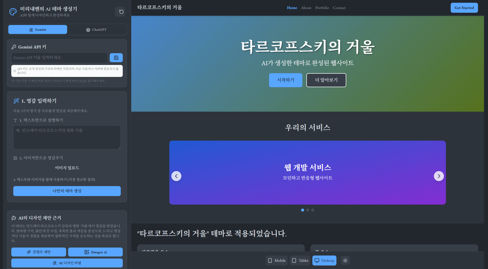
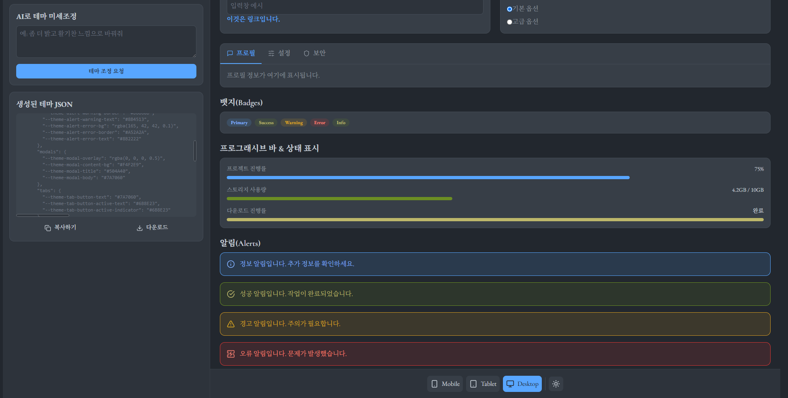

# 🎨 미리내맨 AI 테마 생성기

> AI의 힘으로 웹사이트 테마를 생성하고 실시간으로 미리보기하세요

[](https://mirinaeman-themes-generator-1xaq8w0ch-heglerkims-projects.vercel.app/)

## ✨ 주요 기능

- 🤖 **이중 AI 지원**: Gemini와 ChatGPT 모두 지원
- 📸 **이미지 기반 테마 생성**: 사진을 업로드하여 테마 생성
- 💬 **텍스트 기반 테마 생성**: 설명만으로도 테마 생성 가능
- 🎨 **실시간 미리보기**: 생성된 테마를 즉시 확인
- 🏗️ **완전한 웹사이트 레이아웃**: 히어로, 네비게이션, 카드, 테이블 등
- 🎭 **AI 디자인 비평**: 생성된 테마에 대한 전문적인 피드백
- 📝 **콘텐츠 제안**: 테마에 맞는 웹사이트 콘텐츠 추천
- 🖼️ **AI 이미지 생성**: Imagen과 DALL-E로 배경 이미지 생성
- 📱 **반응형 디자인**: 데스크톱, 태블릿, 모바일 최적화
- 📥 **JSON 다운로드**: 생성된 테마를 파일로 다운로드
- 🔒 **프라이버시 보장**: API 키는 로컬 브라우저에만 저장

## 📸 스크린샷

<!-- 여기에 스크린샷을 추가하세요 -->

*메인 화면 - AI 테마 생성기 인터페이스*


*실시간 테마 미리보기 - 완전한 웹사이트 레이아웃*

## 🚀 시작하기

### 사전 요구사항

다음 중 하나의 API 키가 필요합니다:
- **Google Gemini API 키** ([발급받기](https://makersuite.google.com/app/apikey))
- **OpenAI API 키** ([발급받기](https://platform.openai.com/api-keys))

### 사용 방법

1. **[라이브 데모](https://mirinaeman-themes-generator-1xaq8w0ch-heglerkims-projects.vercel.app/)** 접속
2. **API 제공사 선택** (Gemini 또는 ChatGPT)
3. **API 키 입력** (브라우저에만 저장됨)
4. **테마 생성 방법 선택**:
   - 텍스트 입력: "미니멀한 블로그 테마"
   - 이미지 업로드: 원하는 이미지를 업로드
5. **테마 생성 버튼 클릭**
6. **실시간 미리보기 확인**
7. **JSON 파일 다운로드** (선택사항)

## 🛠️ 기술 스택

- **Frontend**: React 18, JavaScript
- **Styling**: Tailwind CSS
- **Icons**: Lucide React
- **AI APIs**: Google Gemini, OpenAI GPT-4
- **Deployment**: Vercel
- **Build Tool**: Create React App

## 💡 주요 컴포넌트

### 🎯 테마 미리보기 요소
- **히어로 섹션**: 동적 그라데이션 배경
- **네비게이션 바**: 반응형 메뉴
- **캐러셀**: 자동 슬라이드 기능
- **카드 갤러리**: 프로젝트 포트폴리오
- **통계 대시보드**: 수치 및 지표 표시
- **프로그래시브 바**: 진행률 표시
- **데이터 테이블**: 사용자 정보 표시
- **타임라인**: 프로젝트 히스토리
- **댓글 시스템**: 사용자 피드백
- **폼 요소**: 입력창, 버튼, 체크박스

## 🔧 로컬 개발 환경 설정

### 설치

```bash
# 저장소 클론
git clone https://github.com/hegler02/mirinaeman-themes-generator.git

# 프로젝트 디렉토리로 이동
cd mirinaeman-themes-generator

# 의존성 설치
npm install
```

### 개발 서버 실행

```bash
# 개발 서버 시작
npm start

# 브라우저에서 http://localhost:3000 접속
```

### 빌드

```bash
# 프로덕션 빌드
npm run build
```

## 📊 API 사용 비용 (참고)

### 텍스트 생성 (테마 생성 1회당)
- **Gemini**: 약 50-60원
- **ChatGPT**: 약 20-30원

### 이미지 생성 (1장당)
- **Imagen**: 약 55원
- **DALL-E**: 약 55원

*비용은 2025년 기준 추정치이며, 실제 비용은 API 제공사 정책에 따라 변동될 수 있습니다.*

## 🤝 기여하기

1. 이 저장소를 Fork 하세요
2. 새로운 기능 브랜치를 만드세요 (`git checkout -b feature/AmazingFeature`)
3. 변경사항을 커밋하세요 (`git commit -m 'Add some AmazingFeature'`)
4. 브랜치에 Push 하세요 (`git push origin feature/AmazingFeature`)
5. Pull Request를 열어주세요

## 🐛 버그 리포트 및 기능 요청

[Issues](https://github.com/hegler02/mirinaeman-themes-generator/issues)에서 버그 리포트나 기능 요청을 해주세요.

## 📄 라이선스

이 프로젝트는 [MIT 라이선스](LICENSE) 하에 배포됩니다.

## 👨‍💻 개발자

**미리내맨** - [@hegler02](https://github.com/hegler02)

## 🙏 감사의 말

- [Google Gemini](https://gemini.google.com/) - AI 텍스트 및 이미지 생성
- [OpenAI](https://openai.com/) - GPT-4 및 GPT-IMAGE-1
- [Tailwind CSS](https://tailwindcss.com/) - 스타일링 프레임워크
- [Lucide](https://lucide.dev/) - 아이콘 라이브러리
- [Vercel](https://vercel.com/) - 배포 플랫폼

---

⭐ **이 프로젝트가 유용하다면 스타를 눌러주세요!**

[🚀 지금 바로 체험해보기](https://mirinaeman-themes-generator-1xaq8w0ch-heglerkims-projects.vercel.app/) 